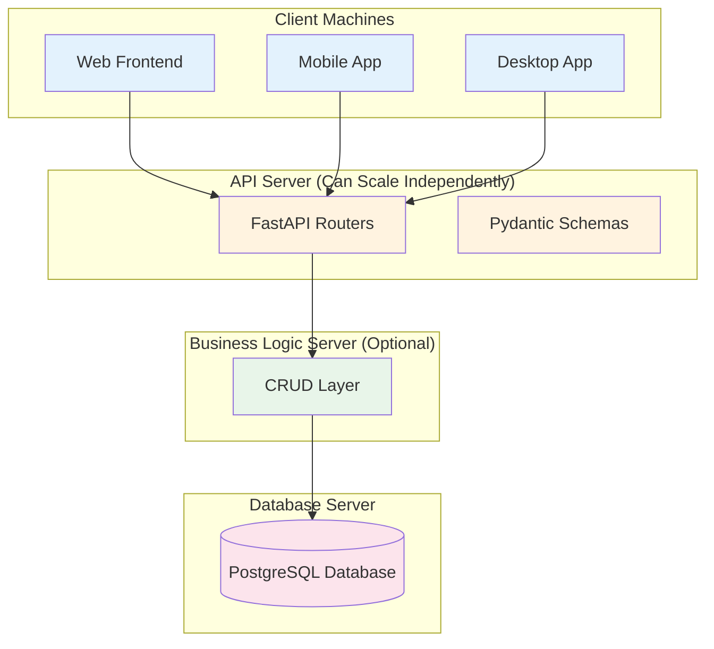

# Educational Bank Project - Architecture & Implementation Guide

This document explains the project structure, why we use this layered architecture, and how to implement new features (such as depositing money) in a clean and scalable way.

---

## 1. Project Directory Structure

```
backend/
├── app/
│   ├── main.py                    # FastAPI application entry point
│   ├── database.py                # Database connection setup
│   ├── dependencies.py            # Shared dependencies (e.g. get current user)
│   │
│   ├── models/                    # SQLAlchemy ORM Models (Database Tables)
│   │   ├── customer.py
│   │   └── account.py
│   │
│   ├── schemas/                   # Pydantic Models (Request & Response shapes)
│   │   ├── customer.py
│   │   └── account.py
│   │
│   ├── crud/                      # Database Operations (Business Logic)
│   │   ├── customer_crud.py
│   │   └── account_crud.py
│   │
│   ├── routers/                   # API Endpoints (URL routes)
│   │   ├── auth.py
│   │   └── accounts.py
│   │
│   └── utils/
│       └── security.py            # Password hashing, etc.
│
├── requirements.txt
├── .env
└── test_endpoints.py
```

---

## 2. Architecture Overview

We follow a **layered architecture** with clear separation of responsibilities:

| Layer          | Purpose                                      | Technology     | Talks To                  |
|----------------|----------------------------------------------|----------------|---------------------------|
| **Routers**    | Define API endpoints (URLs + HTTP methods)   | FastAPI        | Schemas + CRUD            |
| **Schemas**    | Validate incoming data & format responses    | Pydantic       | Routers                   |
| **CRUD**       | Contain business logic & database operations | Python         | Models                    |
| **Models**     | Define database table structure              | SQLAlchemy     | Database                  |
| **Database**   | Store the actual data                        | PostgreSQL     | —                         |

---

## 3. Why This Architecture is Scalable & Modular

This separation allows different parts of the system to run on **different machines** and scale independently.

### Scalability Diagram



### Benefits of This Architecture

- **Independent Scaling**: You can run the API on multiple servers while keeping the database on a powerful machine.
- **Technology Flexibility**: You can later replace the database (e.g., move to MySQL or MongoDB) with minimal changes to the API.
- **Team Collaboration**: One person can work on the frontend, another on the API, and another on the database logic.
- **Testing**: Each layer can be tested in isolation.
- **Reusability**: The same CRUD logic can be used by web, mobile, and even internal admin tools.

---

## 4. How the Layers Work Together

When a request comes in:

1. **Router** receives the HTTP request.
2. **Schema** validates the incoming data.
3. **Router** calls the appropriate **CRUD** function.
4. **CRUD** uses the **Model** to interact with the database.
5. Data flows back: **Model → CRUD → Router → Schema → Client**.

---

## 5. Example: Implementing "Deposit Money"

Below is a step-by-step guide to implement a **Deposit** feature.

### 5.1 High-Level Flow

```
Client → Router → Schema (validate amount) 
       → CRUD (deposit logic) 
       → Model (update balance) 
       → Database
```

### 5.2 Step-by-Step Implementation Guide

#### Step 1: Define the Schema (`schemas/account.py`)

Create a schema for the deposit request:

```python
from pydantic import BaseModel
from decimal import Decimal
from uuid import UUID

class DepositRequest(BaseModel):
    account_id: UUID
    amount: Decimal
```

#### Step 2: Create the CRUD Function (`crud/account_crud.py`)

Add a `deposit` function:

```python
from sqlalchemy.orm import Session
from ..models.account import Account
from decimal import Decimal
from uuid import UUID

def deposit_money(db: Session, account_id: UUID, amount: Decimal):
    account = db.query(Account).filter(Account.account_id == account_id).first()
    
    if not account:
        raise Exception("Account not found")
    
    if amount <= 0:
        raise Exception("Amount must be positive")

    # Update both balances (deposits affect both immediately)
    account.current_balance += amount
    account.available_balance += amount
    
    db.commit()
    db.refresh(account)
    return account
```

**Note**: In a real banking system, you would also create a transaction record here (double-entry).

#### Step 3: Create the Router Endpoint (`routers/accounts.py`)

```python
from fastapi import APIRouter, Depends, HTTPException
from sqlalchemy.orm import Session
from ..schemas.account import DepositRequest, AccountResponse
from ..crud.account_crud import deposit_money
from ..database import get_db

router = APIRouter(prefix="/accounts", tags=["Accounts"])

@router.post("/deposit", response_model=AccountResponse)
def deposit(deposit_data: DepositRequest, db: Session = Depends(get_db)):
    try:
        updated_account = deposit_money(
            db, 
            deposit_data.account_id, 
            deposit_data.amount
        )
        return updated_account
    except Exception as e:
        raise HTTPException(status_code=400, detail=str(e))
```

#### Step 4: (Optional but Recommended) Add Transaction Logging

In a proper system, you should also create a record in the `transactions` table inside the `deposit_money` function. This follows the **double-entry** principle.

---

## 6. Summary & Best Practices

### Key Principles

- **Routers** should stay thin — they only handle HTTP concerns.
- **CRUD** contains the real business logic.
- **Schemas** protect your system from bad data.
- **Models** are only responsible for database structure.

### Recommended Order When Adding New Features

1. Create/Update the **Model** (if new table/column needed)
2. Create the **Schema** (request + response)
3. Write the **CRUD** function
4. Expose it through a **Router**
5. Test using `test_endpoints.py` or Swagger UI

### Final Tip

Always ask yourself:
> "Does this logic belong in the Router, CRUD, or Model?"

- If it's about HTTP or URLs → **Router**
- If it's about data validation or formatting → **Schema**
- If it's about business rules or database operations → **CRUD**
- If it's about table structure → **Model**

---

This architecture will help you (and your son) build clean, maintainable, and scalable applications as the project grows.

**End of Document**